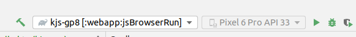

When running the `:webapp:jsBrowserRun` configuration from Android Studio (2022.2.1) the error occurs:

> Querying the mapped value of map(task ':webapp:jsBrowserDevelopmentRun' property 'inputFilesDirectory') before task ':webapp:jsDevelopmentExecutableCompileSync' has completed is not supported

- Kotlin: 1.9.0-Beta
- AGP: 8.0.0

Other notes:
- The error doesn't occur if using kotlin 1.8.21
- The error doesn't occur when running the task from a command line `./gradlew :webapp:jsBrowserRun`

